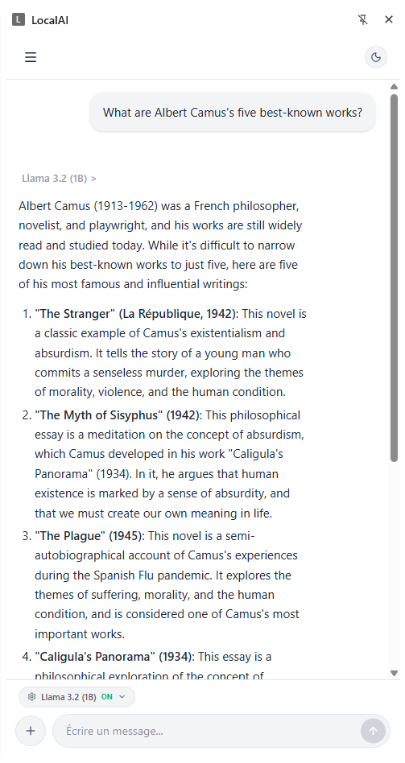

# LocalAI - Private & Local LLM Browser Extension

LocalAI is a powerful browser extension that brings state-of-the-art Large Language Models (LLMs) directly into your browser. Built entirely on WebGPU and [Web-LLM](https://webllm.mlc.ai/), it allows you to run models like Llama 3.2, Qwen 2.5, and Phi-3.5 Vision **100% locally and offline**.

Zero API keys. Zero server tracking. Complete privacy.



## ✨ Features

- **100% Local Execution**: All AI processing happens on your device using WebGPU. No data ever leaves your browser.
- **Multimodal Support (Vision)**: Upload images and analyze them locally using the Phi-3.5 Vision model.
- **Document Analysis**: Attach `.txt`, `.md`, `.json`, `.csv`, and even **`.pdf`** files. The extension automatically extracts the text and feeds it to the AI as context.
- **Hot-Switching Models**: Seamlessly switch between different models during the same conversation without losing context.
- **Model Management**: Download, cache, and delete models directly from the UI. It provides real-time estimates of VRAM usage and your available disk space.
- **Rich Text & Code Highlighting**: Beautifully renders Markdown, tables, and syntax-highlighted code blocks.
- **"Think" Process Visibility**: Supports reasoning models (like DeepSeek) by capturing and displaying the `<think>` blocks in a collapsible UI.

## 📦 Supported Models

LocalAI supports a curated list of models optimized for WebGPU, categorized by their hardware requirements:

### Small Models (< 2GB VRAM)
Perfect for laptops and integrated graphics.
- **Llama 3.2 (1B)** - Fast and capable.
- **TinyLlama (1.1B)** - Ultra-lightweight.
- **Qwen 2.5 (1.5B)** - Excellent reasoning for its size.
- **Gemma 2 (2B)** - Google's open weights model.

### Medium Models (2GB to 5GB VRAM)
Great balance of performance and intelligence.
- **Llama 3.2 (3B)**
- **Qwen 2.5 (3B)**
- **Phi-3.5 Mini (3.8B)**
- **Phi-3.5 Vision** (Image Support 🖼️)
- **Mistral v0.3 (7B)**

### Large Models (> 5GB VRAM)
For high-end GPUs.
- **Llama 3.1 (8B)**
- **Qwen 2.5 (7B)**
- **DeepSeek R1 Distill (7B)**
- **Gemma 2 (9B)**

## 🚀 Getting Started

### Prerequisites
- A modern browser with **WebGPU support** enabled (Google Chrome 113+, Microsoft Edge 113+).
- A dedicated or integrated GPU.

### Installation for Development
1. Clone this repository:
   ```bash
   git clone https://github.com/yourusername/local-ai.git
   cd local-ai
   ```
2. Install dependencies:
   ```bash
   npm install
   ```
3. Build the extension:
   ```bash
   npm run build
   ```
4. Load the extension in your browser:
   - Go to `chrome://extensions/`
   - Enable **Developer mode** (top right corner).
   - Click **Load unpacked** and select the `dist` folder generated by the build process.

## 🛠️ Built With

- [React 19](https://react.dev/) - Frontend Framework
- [Vite](https://vitejs.dev/) - Build Tool
- [Tailwind CSS v4](https://tailwindcss.com/) - Styling
- [Web-LLM](https://webllm.mlc.ai/) - Local LLM Engine (Apache TVM / MLC)
- [PDF.js](https://mozilla.github.io/pdf.js/) - Client-side PDF text extraction
- [Framer Motion](https://www.framer.com/motion/) - UI Animations

## 🔒 Privacy

LocalAI respects your privacy by design. Because the models run entirely via WebGPU within your browser's sandbox:
- **No data collection**
- **No telemetry**
- **No remote API calls to LLM providers**

Your prompts, attached files, and images stay on your machine.

## 📜 License

This project is licensed under the MIT License. See the [LICENSE](LICENSE) file for details.

---

*Note: The first time you use a new model, it will download the model weights to your browser's cache. This might take a few minutes depending on your internet connection, but subsequent loads will be nearly instant.*
